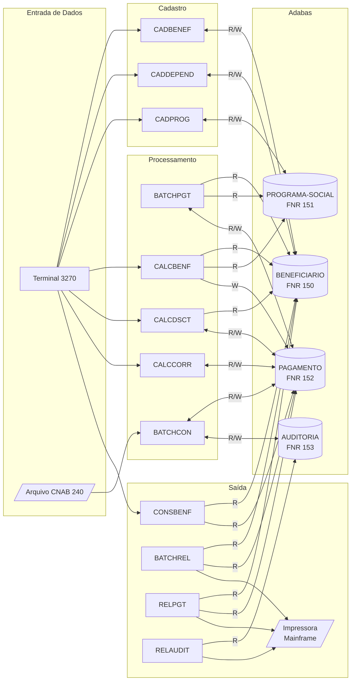

<!-- markdownlint-disable MD013 MD025 MD026 MD028 MD029 MD034 MD040 MD051 MD060 -->

# Mapa de Dependências — SIFAP Legado

  

> 🗺 **Você está aqui:** [Kit PT-BR](../README.md) → [Estágio 1](README.md) → **dependency-map**

> **Para quem é isto?** Este é um **artefato preenchido pelo time** durante o Estágio 1 (Arqueologia).
>
> **O que você terá ao final do estágio:**
>
> 1. Este documento totalmente preenchido com os dados reais do legado SIFAP
> 2. Rastreabilidade para `01-arqueologia/legado-sifap/` (programas `.NSN` e DDMs)
> 3. Base de evidência usada nas EARS do Estágio 2 (`source_legacy:`)
>
> 📘 **Guia passo a passo:** [`GUIDE.md`](GUIDE.md).

> Use diagramas Mermaid para mapear as dependências entre programas Natural e DDMs Adabas.
> O objetivo é visualizar "quem chama quem" e "quem lê/escreve o quê".

## Como descobrir dependências

- Use `grep` ou Copilot Chat para listar todas as ocorrências de `CALLNAT` nos 15 arquivos `.NSN`.
- Prompt útil: _"Liste todas as ocorrências de CALLNAT nestes arquivos e desenhe um diagrama Mermaid."_
- Para leitura/escrita em DDMs: procure por `READ`, `READ LOGICAL`, `STORE`, `UPDATE`, `DELETE`.

## Diagrama de Dependências entre Programas

> **Escopo:** todos os 15 programas `.NSN` + 4 DDMs + 1 arquivo externo (CNAB 240).
>
> **Achado principal:** NENHUM programa usa `CALLNAT` nem `INCLUDE`. Toda lógica é inline ou via `PERFORM` (sub-rotinas internas). O cabeçalho do BATCHPGT diz "CHAMA CALCBENF E CALCDSCT" mas o código **não faz isso** — duplica a lógica.

```mermaid
flowchart TD
  subgraph "Cadastro - Online"
    CADBENEF["CADBENEF<br/>Cad. Beneficiário"]
    CADDEPEND["CADDEPEND<br/>Cad. Dependentes"]
    CADPROG["CADPROG<br/>Cad. Programa Social"]
  end
  subgraph "Cálculo - Online"
    CALCBENF["CALCBENF<br/>Cálc. Benefício"]
    CALCDSCT["CALCDSCT<br/>Cálc. Descontos"]
    CALCCORR["CALCCORR<br/>Correção Retroativa"]
  end
  subgraph "Validação - Online"
    VALBENEF["VALBENEF<br/>Valid. Cadastral"]
    VALDOCS["VALDOCS<br/>Valid. Documentos"]
    VALELEG["VALELEG<br/>Valid. Elegibilidade"]
  end
  subgraph "Consulta - Online"
    CONSBENF["CONSBENF<br/>Consulta Beneficiário"]
  end
  subgraph "Batch"
    BATCHPGT["BATCHPGT<br/>Geração Pagamentos"]
    BATCHCON["BATCHCON<br/>Conciliação Bancária"]
    BATCHREL["BATCHREL<br/>Relatório Consolidado"]
  end
  subgraph "Relatórios"
    RELAUDIT["RELAUDIT<br/>Rel. Auditoria"]
    RELPGT["RELPGT<br/>Rel. Pagamentos"]
  end
  subgraph "DDMs Adabas"
    DDM_BENEF[("BENEFICIARIO<br/>FNR 150")]
    DDM_PROG[("PROGRAMA-SOCIAL<br/>FNR 151")]
    DDM_PGTO[("PAGAMENTO<br/>FNR 152")]
    DDM_AUDIT[("AUDITORIA<br/>FNR 153")]
  end
  CNAB_FILE[/"CNAB 240<br/>Retorno Bancário"/]
  CADBENEF -->|"FIND · STORE · UPDATE"| DDM_BENEF
  CADDEPEND -->|"FIND · UPDATE"| DDM_BENEF
  CADPROG -->|"FIND · STORE"| DDM_PROG
  CALCBENF -->|"FIND"| DDM_BENEF
  CALCBENF -->|"FIND"| DDM_PROG
  CALCBENF -->|"STORE"| DDM_PGTO
  CALCDSCT -->|"FIND · UPDATE"| DDM_PGTO
  CALCDSCT -->|"FIND"| DDM_BENEF
  CALCCORR -->|"READ · UPDATE"| DDM_PGTO
  CONSBENF -->|"FIND"| DDM_BENEF
  CONSBENF -->|"READ"| DDM_PGTO
  VALELEG -->|"FIND"| DDM_BENEF
  VALELEG -->|"FIND"| DDM_PROG
  BATCHPGT -->|"READ"| DDM_BENEF
  BATCHPGT -->|"FIND"| DDM_PROG
  BATCHPGT -->|"FIND · READ · STORE"| DDM_PGTO
  BATCHCON -->|"READ"| CNAB_FILE
  BATCHCON -->|"FIND · UPDATE"| DDM_PGTO
  BATCHCON -->|"READ · STORE"| DDM_AUDIT
  BATCHREL -->|"READ"| DDM_PGTO
  BATCHREL -->|"FIND"| DDM_BENEF
  RELAUDIT -->|"READ"| DDM_AUDIT
  RELPGT -->|"READ"| DDM_PGTO
  RELPGT -->|"FIND"| DDM_BENEF
```

## Diagrama de Fluxo de Dados (DDMs)

## Tabela de Dependências (Programa → DDM)

| Programa | Chama (CALLNAT) | Lê (FIND/READ) DDMs | Escreve (STORE/UPDATE) DDMs | Observações |
| --- | --- | --- | --- | --- |
| CADBENEF.NSN | — | BENEFICIARIO (FIND) | BENEFICIARIO (STORE/UPDATE) | Inclusão, alteração, exclusão lógica |
| CADDEPEND.NSN | — | BENEFICIARIO (FIND) | BENEFICIARIO (UPDATE) | PE group DEPENDENTES, max 5 |
| CADPROG.NSN | — | PROGRAMA-SOCIAL (FIND) | PROGRAMA-SOCIAL (STORE) | Sem alterar/inativar |
| CALCBENF.NSN | — | BENEFICIARIO (FIND), PROGRAMA-SOCIAL (FIND) | PAGAMENTO (STORE) | Fórmula duplicada em BATCHPGT |
| CALCDSCT.NSN | — | BENEFICIARIO (FIND), PAGAMENTO (FIND) | PAGAMENTO (UPDATE) | 6 tipos desconto, cap 30% |
| CALCCORR.NSN | — | PAGAMENTO (READ) | PAGAMENTO (UPDATE) | IPCA hardcoded 2010-2012 |
| CONSBENF.NSN | — | BENEFICIARIO (FIND), PAGAMENTO (READ) | — | Busca por CPF ou NIS, MAP 3270 |
| VALBENEF.NSN | — | — | — | Só valida entrada (CPF mod-11, UF, datas) |
| VALDOCS.NSN | — | — | — | 8 prefixos especiais bypass (backdoor) |
| VALELEG.NSN | — | BENEFICIARIO (FIND), PROGRAMA-SOCIAL (FIND) | — | Região 99 bypass |
| BATCHPGT.NSN | — | BENEFICIARIO (READ), PROGRAMA-SOCIAL (FIND), PAGAMENTO (FIND/READ) | PAGAMENTO (STORE) | Duplica lógica de CALCBENF e CALCDSCT |
| BATCHCON.NSN | — | CNAB 240 (READ), PAGAMENTO (FIND), AUDITORIA (READ) | PAGAMENTO (UPDATE), AUDITORIA (STORE) | Tolerância R$0,01 |
| BATCHREL.NSN | — | BENEFICIARIO (FIND), PAGAMENTO (READ) | — | Bug ROUND vs TRUNCATE |
| RELAUDIT.NSN | — | AUDITORIA (READ) | — | Exclui ações 'EX' do relatório |
| RELPGT.NSN | — | BENEFICIARIO (FIND), PAGAMENTO (READ) | — | TIPO-PGTO 'T' nunca gerado |

## Dependências Circulares

Nenhuma dependência circular existe. Como **nenhum** dos 15 programas usa `CALLNAT` ou `INCLUDE`, não há cadeia de chamadas entre programas — logo, é impossível haver ciclo `A → B → A`.

## Programas Órfãos

Do ponto de vista **inter-programa**, os **15 programas são todos "órfãos"**: nenhum é chamado por outro, pois não há `CALLNAT`. Cada programa é um ponto de entrada independente (transação online 3270 ou job batch). A integração entre eles é feita **pelos dados** (DDMs Adabas compartilhados), nunca por chamada de código.

- **Pontos de entrada online (3270):** CADBENEF, CADDEPEND, CADPROG, CALCBENF, CALCDSCT, CALCCORR, CONSBENF, VALBENEF, VALDOCS, VALELEG
- **Pontos de entrada batch (job):** BATCHPGT, BATCHCON, BATCHREL, RELAUDIT, RELPGT
- **Código morto:** nenhum programa identificado como morto — todos têm transação (Anexo A do Manual) ou agendamento batch.

---

### Continuar a leitura

<table width="100%">
<tr>
<td width="50%" valign="top" align="left">
<strong>← ANTERIOR</strong> 
<a href="business-rules-catalog.md"><strong>business-rules-catalog.md</strong></a> 
Catálogo de regras.
</td>
<td width="50%" valign="top" align="right">
<strong>PRÓXIMO →</strong> 
<a href="discovery-report.md"><strong>discovery-report.md</strong></a> 
Síntese final.
</td>
</tr>
</table>

↑ <a href="README.md">Voltar ao Kit PT-BR</a>

