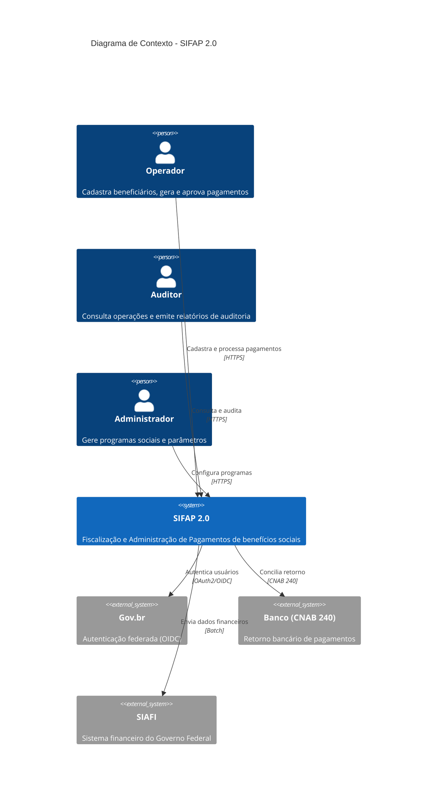
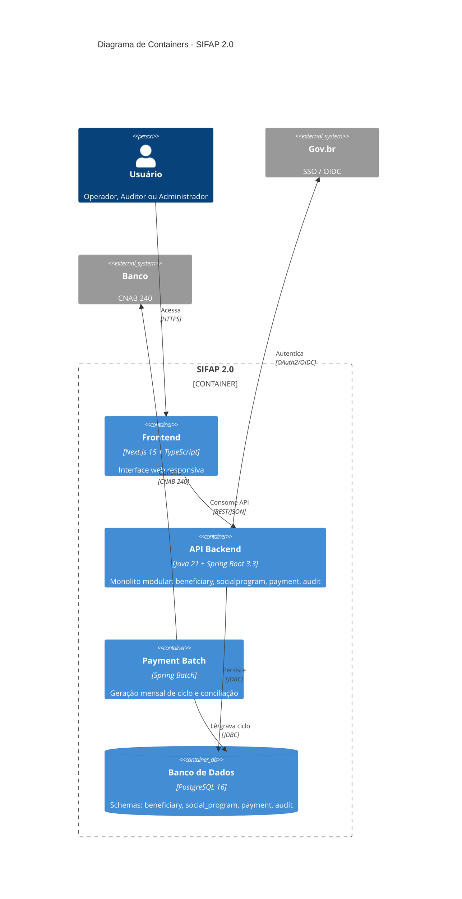
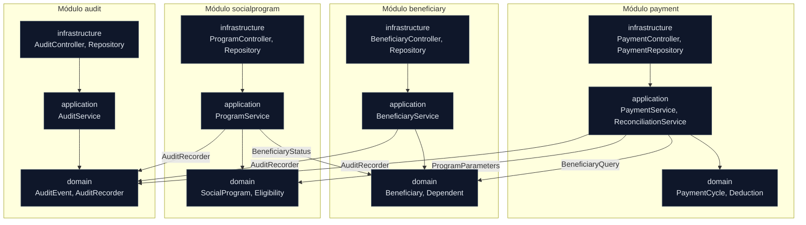

<!-- markdownlint-disable MD013 MD025 MD026 MD028 MD029 MD034 MD040 MD051 MD060 -->

# SPECIFICATION — SIFAP 2.0

 

> 🗺 **Você está aqui:** [Kit PT-BR](../README.md) → [Estágio 2](README.md) → **SPECIFICATION**

## Metadados

- **Versão da spec:** 0.1.0 (Estágio 2 — fim)
- **Data:** 2026-06-10
- **Origem dos requisitos:** [`../01-arqueologia/business-rules-catalog.md`](../01-arqueologia/business-rules-catalog.md) (BR-001 a BR-068) e [`../01-arqueologia/discovery-report.md`](../01-arqueologia/discovery-report.md)
- **Arquitetura:** Monolito Modular ([ADR-001](ADR-001-monolito-modular.md)), 4 bounded contexts ([`bounded-contexts.md`](bounded-contexts.md))
- **Aprovado pelo Product Owner:** ☐ (pendente — sign-off na Passagem #2)

> [!IMPORTANT]
> **Rastreabilidade obrigatória.** Todo REQ-ID abaixo carrega `source_legacy:` apontando para um `.NSN`/`.ddm` em [`../01-arqueologia/legado-sifap/`](../01-arqueologia/legado-sifap/) **ou** `[GREENFIELD]` com justificativa.

---

## 1. Escopo

O SIFAP 2.0 moderniza o ciclo de benefícios sociais: cadastro de beneficiários e dependentes, programas sociais, cálculo e geração de pagamentos, descontos, conciliação bancária e trilha de auditoria. Organizado em **4 módulos** (bounded contexts):

| Módulo | Prefixo REQ | DDM legado |
| --- | --- | --- |
| Beneficiary | `REQ-BEN-*` | BENEFICIARIO (FNR 150) |
| Social Program | `REQ-PRG-*` | PROGRAMA-SOCIAL (FNR 151) |
| Payment | `REQ-PAY-*` | PAGAMENTO (FNR 152) |
| Audit | `REQ-AUD-*` | AUDITORIA (FNR 153) |

---

## 2. Requisitos (EARS)

### 2.1 Módulo Beneficiary

#### REQ-BEN-001 · Validação de CPF (módulo 11)

```yaml
REQ-BEN-001:
  pattern: event-driven
  text: "Quando um beneficiário é incluído ou alterado, o SIFAP deve validar o
         CPF pelo algoritmo módulo 11 da Receita Federal (dois dígitos
         verificadores) e rejeitar CPF inválido."
  source_legacy: 01-arqueologia/legado-sifap/natural-programs/VALBENEF.NSN#L178-L215
  business_rule: BR-020
  acceptance:
    - "CPF com dígito verificador errado → HTTP 400, cadastro bloqueado."
    - "CPF válido → cadastro prossegue."
    - "CPF com todos os dígitos iguais (ex.: 111.111.111-11) → rejeitado."
  priority: P0
  risk: CRÍTICO
```

#### REQ-BEN-002 · CPFs de teste `000` NÃO devem burlar a validação

```yaml
REQ-BEN-002:
  pattern: unwanted
  text: "O SIFAP não deve aceitar CPFs iniciados com 000 como válidos sem
         verificação do dígito verificador (backdoor de teste do legado)."
  source_legacy: 01-arqueologia/legado-sifap/natural-programs/VALBENEF.NSN#L197-L201
  business_rule: BR-050
  acceptance:
    - "CPF 000.000.000-00 → rejeitado (HTTP 400)."
    - "Se ambiente de teste exigir, o bypass só é permitido via feature flag explícita e auditada."
  priority: P0
  risk: CRÍTICO
  notes: "Corrige MYS-007 (backdoor em produção). Decisão consciente em ADR-003."
```

#### REQ-BEN-003 · Campos obrigatórios e domínios de cadastro

```yaml
REQ-BEN-003:
  pattern: event-driven
  text: "Quando um beneficiário é incluído, o SIFAP deve exigir CPF, nome
         (nome + sobrenome), data de nascimento e sexo ('M' ou 'F'), e
         rejeitar a inclusão se qualquer um faltar ou for inválido."
  source_legacy: 01-arqueologia/legado-sifap/natural-programs/CADBENEF.NSN#L116-L130
  business_rule: BR-021, BR-022, BR-023, BR-051
  acceptance:
    - "Nome sem sobrenome (sem espaço) → rejeitado."
    - "Data de nascimento ausente → rejeitado."
    - "Sexo diferente de 'M'/'F' → rejeitado."
  priority: P0
  risk: ALTO
```

#### REQ-BEN-004 · Status inicial ativo e suspensão automática de idosos

```yaml
REQ-BEN-004:
  pattern: complex
  text: "Quando um beneficiário é incluído, o SIFAP deve definir status inicial
         'ACTIVE'; onde a idade for maior que 75 anos, deve definir status
         'SUSPENDED' sobrescrevendo o padrão."
  source_legacy: 01-arqueologia/legado-sifap/natural-programs/CADBENEF.NSN#L161-L168
  business_rule: BR-026, BR-027
  acceptance:
    - "Beneficiário de 40 anos incluído → status ACTIVE."
    - "Beneficiário de 80 anos incluído → status SUSPENDED."
  priority: P0
  risk: ALTO
  notes: "Preserva MYS-001 (regra escondida) tornando-a explícita e auditável."
```

#### REQ-BEN-005 · Limite de dependentes

```yaml
REQ-BEN-005:
  pattern: unwanted
  text: "O SIFAP não deve permitir mais de 5 dependentes por beneficiário."
  source_legacy: 01-arqueologia/legado-sifap/natural-programs/CADDEPEND.NSN#L63
  business_rule: BR-032
  acceptance:
    - "Inclusão do 6º dependente → HTTP 409, bloqueado."
    - "Parentesco fora de {FILHO, CONJUGE, IRMAO, OUTRO} → rejeitado (BR-033)."
  priority: P1
  risk: MÉDIO
  notes: "Limite hardcoded no legado (MYS-002); torna-se parâmetro configurável."
```

#### REQ-BEN-006 · Consulta por CPF ou NIS com mascaramento de CPF

```yaml
REQ-BEN-006:
  pattern: optional
  text: "Onde o operador consultar um beneficiário, o SIFAP deve permitir busca
         por CPF ou por NIS e exibir o CPF mascarado no formato ***.***.NNN-NN."
  source_legacy: 01-arqueologia/legado-sifap/natural-programs/CONSBENF.NSN#L40-L90
  business_rule: BR-047, BR-049
  acceptance:
    - "Busca por NIS retorna o beneficiário correto."
    - "CPF exibido com os 6 primeiros dígitos ocultos."
  priority: P1
  risk: MÉDIO
```

### 2.2 Módulo Social Program

#### REQ-PRG-001 · Ajuste do valor-base pelo Fator-K na inclusão

```yaml
REQ-PRG-001:
  pattern: event-driven
  text: "Quando um programa social é incluído, o SIFAP deve gravar o valor-base
         ajustado pelo Fator-K: VLR_BASE_GRAVADO = VLR_BASE_DIGITADO ×
         (1.00 + FATOR_REAJ × 0.347215)."
  source_legacy: 01-arqueologia/legado-sifap/natural-programs/CADPROG.NSN#L85-L88
  business_rule: BR-036
  acceptance:
    - "VLR_BASE 1000 e FATOR_REAJ 1.0 → grava 1347.22 (truncado em 2 casas)."
    - "A constante 0.347215 é parametrizável, não hardcoded."
  priority: P0
  risk: CRÍTICO
  notes: "Documenta MYS-003 (constante mágica). A origem do 0.347215 segue como mistério aberto."
```

#### REQ-PRG-002 · Elegibilidade por tipo de programa

```yaml
REQ-PRG-002:
  pattern: event-driven
  text: "Quando a elegibilidade é verificada, o SIFAP deve aplicar as regras do
         tipo de programa (A=assistencial, P=previdenciário, T=trabalho),
         incluindo faixa etária e exigências de NIS/dependentes."
  source_legacy: 01-arqueologia/legado-sifap/natural-programs/VALELEG.NSN#L40-L160
  business_rule: BR-057, BR-058, BR-059
  acceptance:
    - "Programa 'A' com renda > R$600 sem dependentes → inelegível."
    - "Idade fora da faixa [IDADE-MIN, IDADE-MAX] do programa → inelegível."
  priority: P0
  risk: ALTO
```

#### REQ-PRG-003 · Região 99 NÃO deve burlar elegibilidade silenciosamente

```yaml
REQ-PRG-003:
  pattern: unwanted
  text: "O SIFAP não deve marcar beneficiários da região 99
         (internacional/diplomático) como elegíveis sem registrar a exceção
         de forma explícita e auditável."
  source_legacy: 01-arqueologia/legado-sifap/natural-programs/VALELEG.NSN#L105-L107
  business_rule: BR-056
  acceptance:
    - "Beneficiário região 99 elegível → evento de auditoria registra a exceção."
    - "A regra de exceção é configurável, não um atalho silencioso."
  priority: P1
  risk: ALTO
  notes: "Preserva MYS-008 tornando-a transparente."
```

### 2.3 Módulo Payment

#### REQ-PAY-001 · Geração do ciclo só para beneficiários ativos

```yaml
REQ-PAY-001:
  pattern: event-driven
  text: "Quando o ciclo de pagamento mensal é gerado, o SIFAP deve criar um
         Payment para cada beneficiário com status ACTIVE vinculado a um
         programa social ACTIVE; demais são ignorados."
  source_legacy: 01-arqueologia/legado-sifap/natural-programs/BATCHPGT.NSN#L195-L227
  business_rule: BR-001, BR-005
  acceptance:
    - "10 beneficiários ACTIVE + 2 SUSPENDED → 10 pagamentos."
    - "Beneficiário ACTIVE em programa inativo → não gera pagamento."
    - "CPF duplicado na competência → apenas 1 pagamento (BR-002, BR-003)."
  priority: P0
  risk: CRÍTICO
```

#### REQ-PAY-002 · Cálculo do valor do benefício

```yaml
REQ-PAY-002:
  pattern: event-driven
  text: "Quando um pagamento é calculado, o SIFAP deve computar VLR_BENEFICIO =
         VLR_BASE × FATOR_REGIONAL × FATOR_FAMILIAR × FATOR_RENDA ×
         FATOR_IDADE × (1 + FATOR_REAJUSTE)."
  source_legacy: 01-arqueologia/legado-sifap/natural-programs/CALCBENF.NSN#L225-L233
  business_rule: BR-006, BR-007, BR-008, BR-009, BR-010
  acceptance:
    - "Fatores conforme tabelas BR-006 a BR-009 produzem o valor esperado."
    - "Região fora de 1–25 usa fator 1.0000."
    - "A fórmula vive apenas no módulo payment (fonte única)."
  priority: P0
  risk: CRÍTICO
  notes: "Resolve a duplicação BATCHPGT × CALCBENF (ADR-001)."
```

#### REQ-PAY-003 · Truncamento (não arredondamento) de valores monetários

```yaml
REQ-PAY-003:
  pattern: ubiquitous
  text: "O SIFAP deve truncar valores monetários do cálculo de pagamento em 2
         casas decimais (multiplica por 100, converte para inteiro, divide por
         100), nunca arredondar."
  source_legacy: 01-arqueologia/legado-sifap/natural-programs/CALCBENF.NSN#L231-L233
  business_rule: BR-011
  acceptance:
    - "Valor 123.459 → 123.45 (truncado, não 123.46)."
  priority: P0
  risk: ALTO
  notes: "Padroniza divergência TRUNCATE × ROUND (MYS-005 / BR-063). Política única definida aqui."
```

#### REQ-PAY-004 · 13º benefício em dezembro

```yaml
REQ-PAY-004:
  pattern: complex
  text: "Enquanto o beneficiário estiver ACTIVE, quando o ciclo for gerado em
         dezembro, o SIFAP deve calcular o 13º com fórmula diferenciada
         (VLR_BASE × FATOR_REGIONAL × FATOR_IDADE) e marcar tipo de pagamento 'D'."
  source_legacy: 01-arqueologia/legado-sifap/natural-programs/CALCBENF.NSN#L239-L245
  business_rule: BR-012, BR-068
  acceptance:
    - "Ciclo de dezembro gera pagamento tipo 'D' com a fórmula de 13º."
    - "Programas tipo 'A' recebem abono natalino de 15% (BR-013)."
  priority: P0
  risk: ALTO
```

#### REQ-PAY-005 · Teto de 30% para descontos não judiciais

```yaml
REQ-PAY-005:
  pattern: unwanted
  text: "O SIFAP não deve permitir que o total de descontos NÃO judiciais
         exceda 30% do valor bruto do pagamento."
  source_legacy: 01-arqueologia/legado-sifap/natural-programs/CALCDSCT.NSN#L101-L123
  business_rule: BR-040, BR-041
  acceptance:
    - "Bruto 1000, desconto TAX 400 → aplicado 300 (truncado em 30%)."
    - "Contribuição progressiva: ≤500→3%, ≤1000→5%, ≤2000→7%, >2000→9%."
  priority: P0
  risk: CRÍTICO
```

#### REQ-PAY-006 · Desconto judicial sem teto

```yaml
REQ-PAY-006:
  pattern: event-driven
  text: "Quando um desconto do tipo JUDICIAL é aplicado, o SIFAP deve somá-lo
         integralmente ao total de descontos, sem aplicar o teto de 30%."
  source_legacy: 01-arqueologia/legado-sifap/natural-programs/CALCDSCT.NSN#L124-L131
  business_rule: BR-041, BR-043
  acceptance:
    - "Desconto judicial de 50% do bruto é aceito integralmente."
    - "Desconto vencido ou futuro (vigência) é ignorado (BR-042)."
  priority: P0
  risk: CRÍTICO
```

#### REQ-PAY-007 · Status inicial do pagamento

```yaml
REQ-PAY-007:
  pattern: ubiquitous
  text: "O SIFAP deve criar todo novo Payment com status 'GENERATED' (G)."
  source_legacy: 01-arqueologia/legado-sifap/natural-programs/BATCHPGT.NSN#L332
  business_rule: BR-016, BR-065
  acceptance:
    - "Pagamento recém-criado tem status='GENERATED'."
    - "Estados válidos: G, P (pago), C (cancelado), D (devolvido), E (estornado)."
  priority: P0
  risk: ALTO
  notes: "Legado grava 'G' apesar do manual dizer 'P' (BR-016, divergência doc×código)."
```

#### REQ-PAY-008 · Conciliação bancária CNAB 240

```yaml
REQ-PAY-008:
  pattern: event-driven
  text: "Quando um arquivo de retorno CNAB 240 é processado, o SIFAP deve
         atualizar o status do pagamento: '00'→PAID, '01'→RETURNED, '02'→REVERSED,
         tolerando diferença de até R$0,01 entre valor SIFAP e valor do banco."
  source_legacy: 01-arqueologia/legado-sifap/natural-programs/BATCHCON.NSN#L150-L160
  business_rule: BR-060, BR-061
  acceptance:
    - "Retorno '00' com diferença de R$0,005 → status PAID."
    - "Diferença de R$0,02 → divergência registrada em auditoria (ação DV)."
  priority: P0
  risk: CRÍTICO
```

### 2.4 Módulo Audit

#### REQ-AUD-001 · Trilha de auditoria imutável

```yaml
REQ-AUD-001:
  pattern: unwanted
  text: "O SIFAP não deve permitir UPDATE ou DELETE em registros de auditoria."
  source_legacy: "[GREENFIELD] Imutabilidade de trilha exigida por compliance (TCU/CGU); o legado grava mas não protege contra remoção."
  business_rule: BR-067
  acceptance:
    - "Tentativa de DELETE em audit_event → HTTP 403."
    - "Tentativa de UPDATE → HTTP 403."
  priority: P0
  risk: CRÍTICO
```

#### REQ-AUD-002 · Registro de auditoria em toda operação sensível

```yaml
REQ-AUD-002:
  pattern: event-driven
  text: "Quando uma entidade é incluída, alterada, conciliada ou diverge, o
         SIFAP deve gravar um evento de auditoria com estado anterior, estado
         novo, usuário, timestamp UTC e ação (IN/AL/CO/DV)."
  source_legacy: 01-arqueologia/legado-sifap/natural-programs/BATCHCON.NSN#L150-L170
  business_rule: BR-062, BR-067
  acceptance:
    - "Conciliação com divergência grava ação 'DV' com valor SIFAP e valor banco."
    - "Evento contém os 5 campos obrigatórios."
  priority: P0
  risk: CRÍTICO
  notes: "Corrige BR-030 (CADBENEF não auditava, apesar do manual)."
```

#### REQ-AUD-003 · Eventos de exclusão NÃO devem ser ocultados do relatório

```yaml
REQ-AUD-003:
  pattern: unwanted
  text: "O SIFAP não deve omitir eventos de auditoria com ação 'EX' (exclusão)
         dos relatórios de auditoria."
  source_legacy: 01-arqueologia/legado-sifap/natural-programs/RELAUDIT.NSN#L103-L105
  business_rule: BR-066
  acceptance:
    - "Relatório de auditoria inclui eventos de ação 'EX'."
    - "Nenhum filtro padrão oculta exclusões."
  priority: P0
  risk: CRÍTICO
  notes: "Corrige MYS-010 (exclusões ocultas no legado)."
```

#### REQ-AUD-004 · Mascaramento de CPF em logs (LGPD)

```yaml
REQ-AUD-004:
  pattern: ubiquitous
  text: "O SIFAP deve mascarar CPF em todos os logs no formato XXX.XXX.NNN-NN."
  source_legacy: "[GREENFIELD] LGPD Art. 6º (minimização) — sem equivalente no legado."
  business_rule: "—"
  acceptance:
    - "Log de DEBUG não imprime CPF cru."
    - "Endpoint /actuator/logfile não vaza CPF."
  priority: P0
  risk: CRÍTICO
```

---

## 3. Rastreabilidade (BR legado → REQ-ID moderno)

| BR (legado) | REQ-ID (moderno) | Status |
| --- | --- | --- |
| BR-001, BR-002, BR-003, BR-005 | REQ-PAY-001 | ✅ coberta |
| BR-006…BR-010 | REQ-PAY-002 | ✅ coberta |
| BR-011 | REQ-PAY-003 | ✅ coberta |
| BR-012, BR-013, BR-068 | REQ-PAY-004 | ✅ coberta |
| BR-040, BR-041 | REQ-PAY-005 | ✅ coberta |
| BR-041, BR-042, BR-043 | REQ-PAY-006 | ✅ coberta |
| BR-016, BR-065 | REQ-PAY-007 | ✅ coberta |
| BR-060, BR-061 | REQ-PAY-008 | ✅ coberta |
| BR-020 | REQ-BEN-001 | ✅ coberta |
| BR-050 | REQ-BEN-002 | ✅ coberta |
| BR-021, BR-022, BR-023, BR-051 | REQ-BEN-003 | ✅ coberta |
| BR-026, BR-027 | REQ-BEN-004 | ✅ coberta |
| BR-032, BR-033 | REQ-BEN-005 | ✅ coberta |
| BR-047, BR-049 | REQ-BEN-006 | ✅ coberta |
| BR-036 | REQ-PRG-001 | ✅ coberta |
| BR-057, BR-058, BR-059 | REQ-PRG-002 | ✅ coberta |
| BR-056 | REQ-PRG-003 | ✅ coberta |
| BR-030, BR-062, BR-067 | REQ-AUD-001, REQ-AUD-002 | ✅ coberta |
| BR-066 | REQ-AUD-003 | ✅ coberta |
| BR-044, BR-045, BR-046 | — | ⏸ fora de escopo (correção retroativa — ver scope-decisions.md) |

> ✅ **21 REQ-IDs**, 100% com `source_legacy:` (19 apontam para `.NSN`, 2 GREENFIELD justificados).

---

## 4. Atributos de Qualidade (NFRs)

| Atributo | Meta | Como medir |
| --- | --- | --- |
| Latência p95 | < 200 ms para queries de listagem | Testes de performance (Estágio 4) |
| Cobertura de testes | ≥ 70% de linhas no módulo `payment` | JaCoCo no CI |
| Segurança | LGPD (mascaramento PII) + OWASP Top 10 | Code review + REQ-AUD-004 |
| Auditabilidade | 100% das operações sensíveis auditadas | REQ-AUD-002 |
| Disponibilidade | 99,5% (excluindo janela batch) | Health check + monitoring |

---

## 5. Diagrama C4 L1 — Contexto



## 6. Diagrama C4 L2 — Containers



---

## 7. Diagrama de Módulos (Monolito Modular)

> Estrutura dos 4 módulos do backend ([ADR-001](ADR-001-monolito-modular.md)). Cada módulo tem 3 camadas (`domain` / `application` / `infrastructure`). A comunicação inter-módulo ocorre **apenas** via interfaces de `domain` (setas), nunca importando `infrastructure` de outro módulo — fronteira validada por ArchUnit no CI.



| Módulo | Schema PostgreSQL | DDM legado | Interface pública exposta |
| --- | --- | --- | --- |
| `beneficiary` | `beneficiary` | BENEFICIARIO | `BeneficiaryQuery`, `BeneficiaryStatus` |
| `socialprogram` | `social_program` | PROGRAMA-SOCIAL | `ProgramParameters`, `EligibilityCheck` |
| `payment` | `payment` | PAGAMENTO | `PaymentCycle`, `PaymentReconciliation` |
| `audit` | `audit` | AUDITORIA | `AuditRecorder`, `AuditReport` |

## 8. Cenários BDD

Os cenários de aceitação em formato BDD (Dado/Quando/Então) estão em [`bdd-scenarios.md`](bdd-scenarios.md), cobrindo as 3 regras mais críticas: teto de descontos, geração de ciclo e backdoor de CPF.

## 9. ADRs relacionados

- [ADR-001 — Monolito Modular](ADR-001-monolito-modular.md)
- [ADR-002 — Migração de Dados (Expand-Contract)](ADR-002-migracao-dados.md)
- [ADR-003 — Autenticação Gov.br + RBAC](ADR-003-autenticacao-autorizacao.md)
- [Bounded Contexts](bounded-contexts.md) · [Decisões de Escopo](scope-decisions.md)
