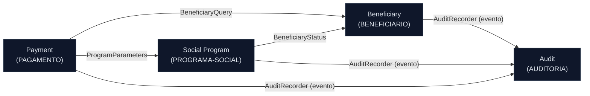

<!-- markdownlint-disable MD013 MD025 MD026 MD028 MD029 MD034 MD040 MD051 MD060 -->

# Mapa de Bounded Contexts — SIFAP 2.0

 

> 🗺 **Você está aqui:** [Kit PT-BR](../README.md) → [Estágio 2](README.md) → **bounded-contexts**

> **Origem:** derivado de [`../01-arqueologia/dependency-map.md`](../01-arqueologia/dependency-map.md), [`../01-arqueologia/business-rules-catalog.md`](../01-arqueologia/business-rules-catalog.md) e [`../01-arqueologia/discovery-report.md`](../01-arqueologia/discovery-report.md).

**Data**: 2026-06-10 · **Líder**: Par 2 (EA + SA)

## Princípio de recorte

O legado **não tem acoplamento por código** (zero `CALLNAT`): a integração é toda **pelos dados** (4 DDMs Adabas compartilhados). Por isso, o recorte natural de bounded contexts segue a **propriedade dos dados (DDM)** somada à coesão de regras de negócio por programa. Cada DDM vira o núcleo de um contexto.

## Avaliações de Hipóteses

### Hipótese A: "Validação" como contexto próprio — REJEITADO

| Critério | Avaliação | Evidência |
| --- | --- | --- |
| Coesão | Baixa | VALBENEF/VALDOCS validam dados do beneficiário; VALELEG cruza beneficiário × programa. Não formam um domínio coeso isolado. |
| Acoplamento | Alto | Validação só existe em função de Beneficiário e Programa Social — não tem dados nem ciclo de vida próprios. |
| Frequência de mudança | Média | Muda junto com as regras de cadastro/elegibilidade, não de forma independente. |

**Decisão:** validação é **comportamento** dentro dos contextos Beneficiary (cadastral/documental) e Social Program (elegibilidade), não um contexto separado.

### Hipótese B: "Cálculo" separado de "Pagamento" — REJEITADO

| Critério | Avaliação | Evidência |
| --- | --- | --- |
| Coesão | Alta dentro de Pagamento | CALCBENF/CALCDSCT/CALCCORR escrevem o mesmo DDM PAGAMENTO que BATCHPGT consome. BR-001…BR-018 e BR-040…BR-046 são o mesmo fluxo financeiro. |
| Acoplamento | Altíssimo | BATCHPGT duplica inline a lógica de CALCBENF/CALCDSCT — separar criaria dois donos para a mesma regra. |
| Frequência de mudança | Conjunta | Mudança de fórmula afeta cálculo e geração juntos. |

**Decisão:** cálculo e geração de pagamento são **um único contexto** (Payment), com a fórmula como fonte única de verdade (resolve a dívida de duplicação — ver [ADR-001](ADR-001-monolito-modular.md)).

### Hipótese C: Contexto por DDM (4 contextos) — ACEITO

| Critério | Avaliação | Evidência |
| --- | --- | --- |
| Coesão | Alta | Cada DDM agrupa um conjunto coeso de regras (cadastro, programa, pagamento, auditoria). |
| Acoplamento | Gerenciável | Comunicação por IDs (CPF, código de programa) e eventos de auditoria. |
| Frequência de mudança | Independente | Auditoria muda por compliance; pagamento por norma de cálculo; cadastro por regras de elegibilidade. |

**Decisão:** **4 bounded contexts**, um por DDM, com Auditoria como contexto transversal.

## Bounded Contexts Finais

### 1. Beneficiary (Beneficiário)

- **Responsabilidade:** cadastro, alteração e consulta de beneficiários e seus dependentes; validação cadastral (CPF, nome, data, UF) e documental; ciclo de status do beneficiário (A/S/C/I/D).
- **Dados sob ownership:** DDM `BENEFICIARIO` (FNR 150) → tabelas `beneficiary`, `beneficiary_dependent`.
- **Interface pública:** `BeneficiaryQuery` (busca por CPF/NIS), `BeneficiaryStatus` (status atual para elegibilidade e pagamento).
- **Programas legados:** CADBENEF, CADDEPEND, CONSBENF, VALBENEF, VALDOCS.
- **Regras:** BR-019…BR-035, BR-047…BR-055.
- **Por que é seu próprio contexto:** é o registro mestre de identidade; tem ciclo de vida e validações próprias, independentes de pagamento.

### 2. Social Program (Programa Social)

- **Responsabilidade:** cadastro de programas sociais e seus parâmetros (valor-base, faixas, tipo A/P/T); regras de elegibilidade que cruzam beneficiário × programa.
- **Dados sob ownership:** DDM `PROGRAMA-SOCIAL` (FNR 151) → tabela `social_program`.
- **Interface pública:** `ProgramParameters` (valor-base, fator-K, tipo), `EligibilityCheck` (beneficiário é elegível ao programa?).
- **Programas legados:** CADPROG, VALELEG.
- **Regras:** BR-036…BR-039, BR-056…BR-059.
- **Por que é seu próprio contexto:** parâmetros de programa mudam por norma regulatória, em cadência diferente do cadastro e do cálculo.

### 3. Payment (Pagamento)

- **Responsabilidade:** cálculo do valor do benefício e descontos, geração do ciclo mensal de pagamentos, correção retroativa, conciliação bancária (CNAB 240) e ciclo de status do pagamento (G/P/C/D/E).
- **Dados sob ownership:** DDM `PAGAMENTO` (FNR 152) → tabelas `payment`, `payment_deduction`.
- **Interface pública:** `PaymentCycle` (gerar ciclo), `PaymentReconciliation` (conciliar retorno bancário).
- **Programas legados:** CALCBENF, CALCDSCT, CALCCORR, BATCHPGT, BATCHCON, RELPGT.
- **Regras:** BR-001…BR-018, BR-040…BR-046, BR-060…BR-065, BR-068.
- **Por que é seu próprio contexto:** núcleo financeiro do sistema; concentra as regras críticas e é o hub de dados (8 dos 15 programas acessam PAGAMENTO).

### 4. Audit (Auditoria)

- **Responsabilidade:** trilha de auditoria imutável de todas as operações (inclusão, alteração, conciliação, divergência, exclusão); relatórios de auditoria.
- **Dados sob ownership:** DDM `AUDITORIA` (FNR 153) → tabela `audit_event`.
- **Interface pública:** `AuditRecorder` (gravar evento — consumido por todos os outros contextos), `AuditReport`.
- **Programas legados:** RELAUDIT (+ gravação de auditoria em BATCHCON).
- **Regras:** BR-030, BR-062, BR-066, BR-067.
- **Por que é seu próprio contexto:** é transversal e tem requisito de imutabilidade/compliance próprio, independente de quem gera o evento.

## Comunicação Entre Contextos

| De | Para | Mecanismo | Dados |
| --- | --- | --- | --- |
| Payment | Beneficiary | Chamada in-process (interface `BeneficiaryQuery`) | CPF/NIS → status, dependentes, renda |
| Payment | Social Program | Chamada in-process (interface `ProgramParameters`) | Código de programa → valor-base, fator-K, tipo |
| Social Program | Beneficiary | Chamada in-process (interface `BeneficiaryStatus`) | CPF → idade, status, dependentes (elegibilidade) |
| Beneficiary | Audit | Evento de domínio (`AuditRecorder`) | Inclusão/alteração de beneficiário |
| Payment | Audit | Evento de domínio (`AuditRecorder`) | Geração, conciliação, divergência (DV) |
| Social Program | Audit | Evento de domínio (`AuditRecorder`) | Inclusão de programa |

---

**Definição de Pronto:** ✅ hipóteses avaliadas (A e B rejeitadas, C aceita), ✅ rejeições documentadas com evidência, ✅ 4 contextos nomeados com ownership de dados, ✅ Mermaid renderiza.
